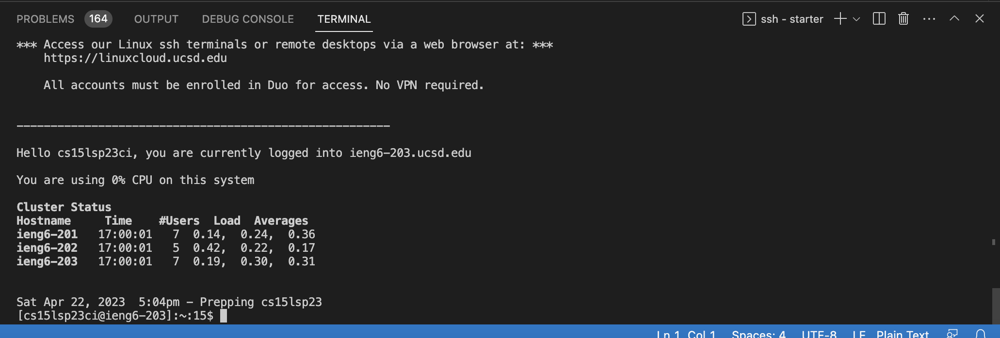
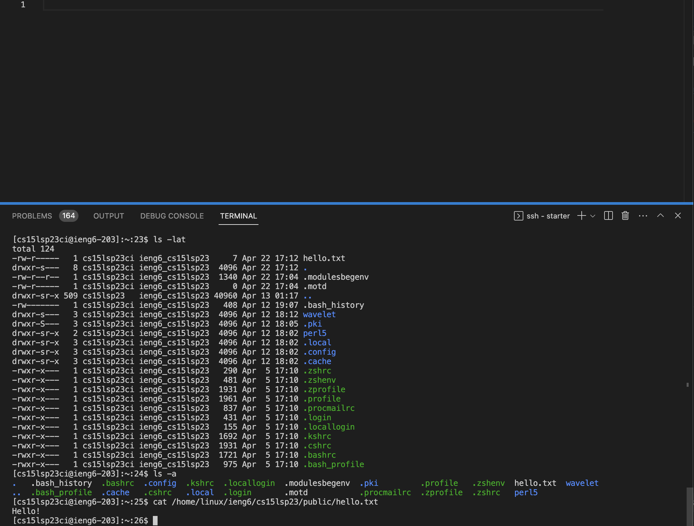

# CS15L Lab Report 1

# Step 1

First go to [VSCodewebsite](https://code.visualstudio.com/) and follow the instructions to either download for mac os or windows. After installation open visual studio code and it should look like this: 

# Step 2

After opening up Visual studio code click new file. After making a new file go to the terminal. To get to terminal you can either click (command or Ctrl + \`)
or go to the top of your computer and click terminal and then click new terminal. After opening up the terminal type

`ssh cs15lsp23zz@ieng6.ucsd.edu`

The `zz` should be your own personal two letters. To find what you login is go to https://sdacs.ucsd.edu/~icc/index.php. Then log in with your username and student id and see what your account name is and fill in the zz with your two letters. After typing that a message will appear and type yes after the message appears. Then it will ask you for the password. 

After logging in this should show up on your terminal. 

# Step 3

After succesfully logging in you are supposed to run some commands. The commands you should run are:

* `cd `
* `cd~`
+ `ls -lat`
+ `ls -a`
+ `ls \<directory>` where `<directory>` is `/home/linux/ieng6/cs15sp23abc`, where `abc` is someone else's name that is in the group
+ `cp /home/linux/ieng6/cs15lsp23/public/hello.txt ~/`
+ `cat /home/linux/ieng6/cs15lsp23/public/hello.txt`

These are a couple commands I put in: 

The `ls -lat` command lists the names and features of files and directories.
The `ls -a` command is used to list contents of present working directory. 
The `cat /home/linux/ieng6/cs15lsp23/public/hello.txt` prints hello.

