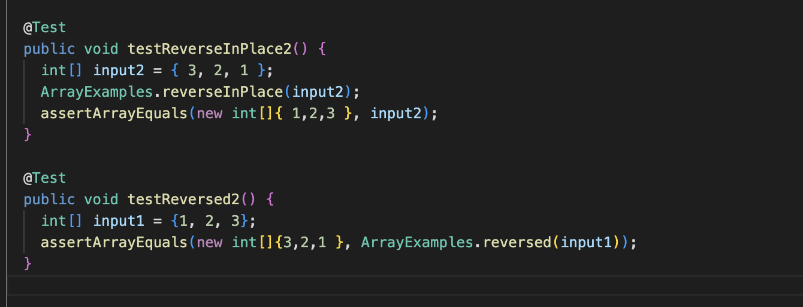

# CSE 15L Lab Report 2

# Part 1

My code for the web server is: 
My main method is handleRequest, but the smaller methods are String.format(), URI.getPath(), String.contains(), String.split(), and String.equals(). 

The relevant arugments for those methods are: 
* String.format() takes in "Hello" as an argument.
* URI.getPath() takes in no arguments but returns a string showing the path component of the URI object.
* String.contains() takes in the string "/add" as an argument and returns a boolean value whether or not the path component of the URI object has "/add".
* String.split() takes in the equals sign as the delimiter to split the query component.
* String.equals() takes in the string "s" as an argument to compare it with the first element of the array returned by String.split().

The messages string is the only value that changes, it stores the accumulated messages that are added by the user through the URL. 
 

# Part 2
 
 
This is the bug I chose from lab 3. For the reverse in place you would have to switch the elements at both ends at the same time for the switch to be successful.Then for reversed you should add the orignal array into the new array not the new array in the original array.

# Part 3 

Something I learned in lab in the past two weeks was about web servers. I did not really know anything about web servers before, but after the past two weeks I understand what they are and how to create one. It was also very interesting to me that when we were in lab and we created a web server where we could also access it remotely. 
