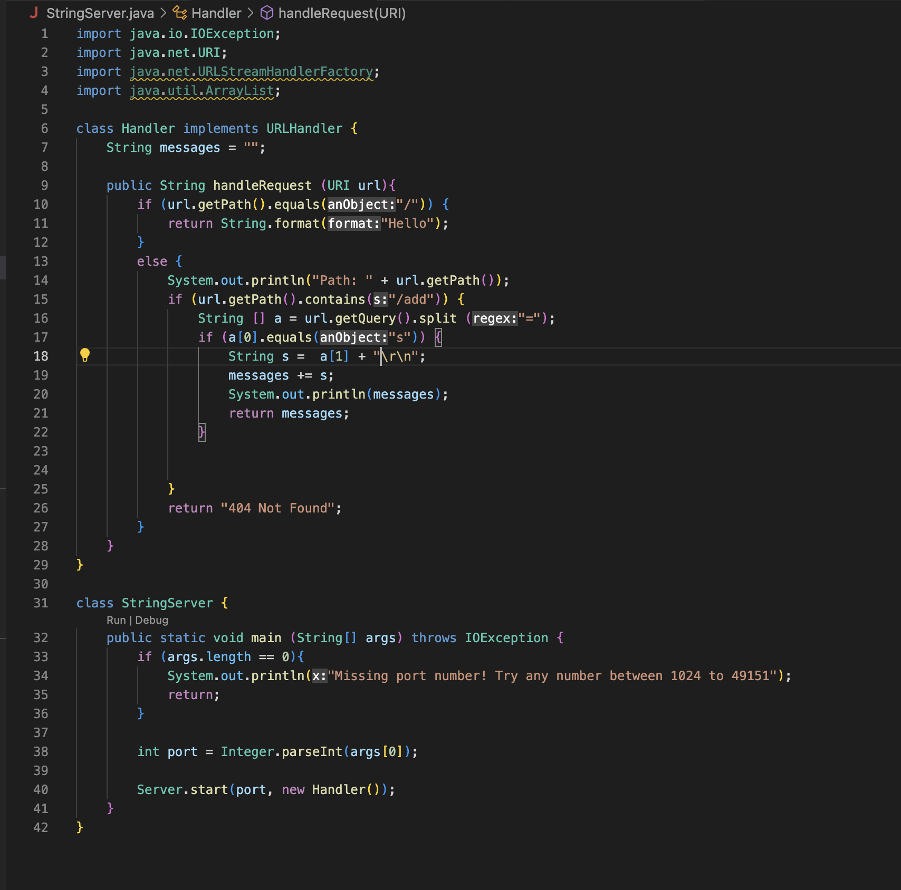
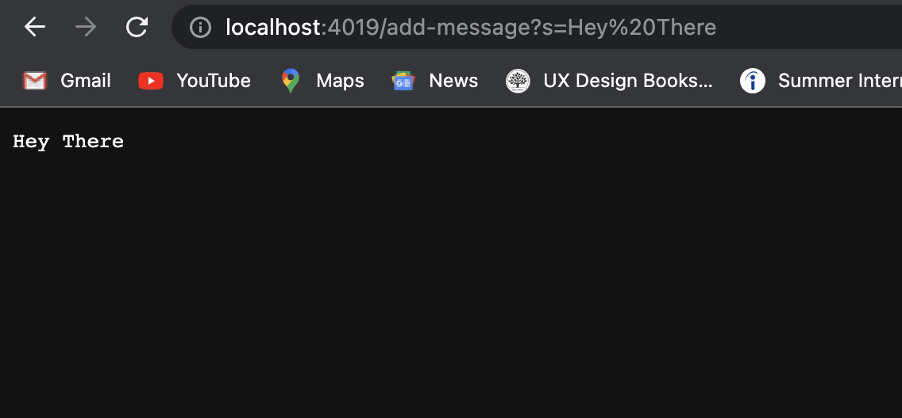
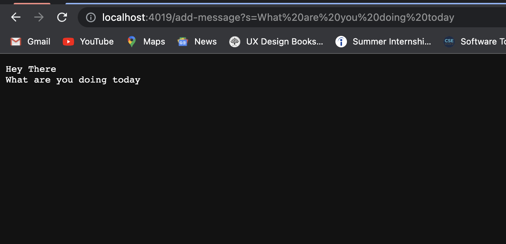
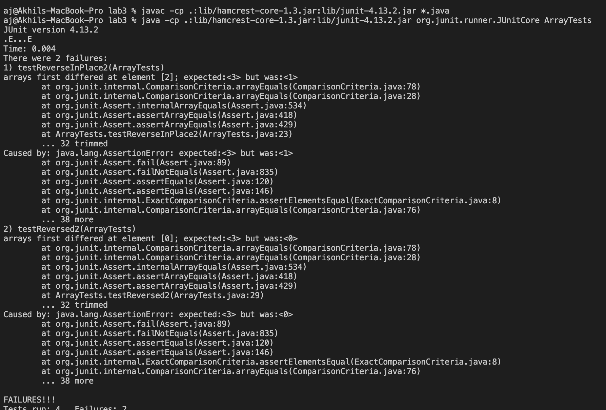

# CSE 15L Lab Report 2

# Part 1

My code for the web server is: 
My main method is handleRequest, but the smaller methods are String.format(), URI.getPath(), String.contains(), String.split(), and String.equals(). 

The relevant arugments for those methods are: 
```
* String.format() takes in "Hello" as an argument.
* URI.getPath() takes in no arguments but returns a string showing the path component of the URI object.
* String.contains() takes in the string "/add" as an argument and returns a boolean value whether or not the path component of the URI object has "/add".
* String.split() takes in the equals sign as the delimiter to split the query component.
* String.equals() takes in the string "s" as an argument to compare it with the first element of the array returned by String.split().
```

The messages string is the only value that changes, it stores the accumulated messages that are added by the user through the URL. 
 


# Part 2
```
@Test 
	public void testReverseInPlace() {
    int[] input1 = { 3 };
    ArrayExamples.reverseInPlace(input1);
    assertArrayEquals(new int[]{ 3 }, input1);
	}


  @Test
  public void testReversed() {
    int[] input1 = { };
    assertArrayEquals(new int[]{ }, ArrayExamples.reversed(input1));
  }
  ```
These are the tests that work for the arraytests. These tests worked because the input was easy of enough to work.

``` 
public void testReverseInPlace2() {
    int[] input2 = { 3, 2, 1 };
    ArrayExamples.reverseInPlace(input2);
    assertArrayEquals(new int[]{ 1,2,3 }, input2);
	}

  @Test
  public void testReversed2() {
    int[] input1 = {1, 2, 3};
    assertArrayEquals(new int[]{3,2,1 }, ArrayExamples.reversed(input1));
  }
  ```
  These are the tests that failed.
 
``` 
static void reverseInPlace(int[] arr) {
    for(int i = 0; i < arr.length; i += 1) {
      arr[i] = arr[arr.length - i - 1];
    }
  }

  // Returns a *new* array with all the elements of the input array in reversed
  // order
  static int[] reversed(int[] arr) {
    int[] newArray = new int[arr.length];
    for(int i = 0; i < arr.length; i += 1) {
      arr[i] = newArray[arr.length - i - 1];
    }
    return arr;
  }
```
This is the bugged code for reverseInPlace and reversed. 
The issue with reveresedInPlace is the array changes its reference to the first element, so when we loop to the last element the first element does not hold the original value. 

The issue with reversed is the code keeps going through the array with the default value of 0, and then it also has the same issue as reverseInPlace.

The correct code for both are: 
```
static void reverseInPlace(int[] arr) {
    if (arr.length != 0){
      int hold = arr[0];
      for(int i = 0; i < arr.length; i += 1) {
        if(i!= arr.length - 1){
          arr[i] = arr[arr.length - 1];
        }
        else{
          arr[i] = hold;
        }
      }
    }
    
  }

  // Returns a *new* array with all the elements of the input array in reversed
  // order
  static int[] reversed(int[] arr) {
    int[] newArray = new int[arr.length];
    if (arr.length != 0){
      int hold = arr[0];
      
      for(int i = 0; i < arr.length; i += 1) {
        if (i!= arr.length-1){
          newArray[i] = arr[arr.length -i -1];
        } 
        else {
          newArray[i] = hold;
       }
      }
    }
    return newArray;
  }
  ```
  The fix I did for reverseInPlace was to create a new variable so it can hold the value so you can do the reverse method after. The fix I did for reverse was similar as reverseInPlace becasue I created a new variable to hold the first element value.
# Part 3 

Something I learned in lab in the past two weeks was about web servers. I did not really know anything about web servers before, but after the past two weeks I understand what they are and how to create one. It was also very interesting to me that when we were in lab and we created a web server where we could also access it remotely. 
