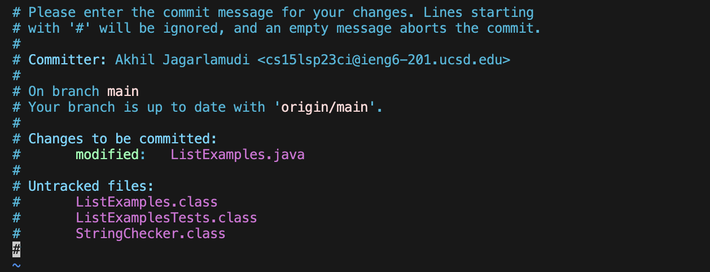

# CSE 15L Lab Report 4

The first step was the log in to ieng6: 

The keys I pressed were:
``` 
ssh cs15lsp23ci@ieng6.ucsd.edu <enter>
Password <enter>
```

Then my next command was:
```
git clone https://github.com/ajag3/lab7.git <enter>
```
To run the tests to see them fail I typed out:
```
javac -cp .:lib/hamcrest-core-1.3.jar:lib/junit-4.13.2.jar *.java
java -cp .:lib/hamcrest-core-1.3.jar:lib/junit-4.13.2.jar org.junit.runner.JUnitCore ListExamplesTests
```


To fix the code the keys I pressed were:
```
Cd lab7
Vim ListExamples.java
/index1 <enter>
n (8 times)
l (5 times)
x (delete)
i (insert)
2 <esc>
:wq <Enter>
```


To check if the tests ran properly I clicked:
```
<up><up><up><up><enter>
javac -cp .:lib/hamcrest-core-1.3.jar:lib/junit-4.13.2.jar *.java <enter>
<up><up><up><up><enter> 
java -cp .:lib/hamcrest-core-1.3.jar:lib/junit-4.13.2.jar org.junit.runner.JUnitCore ListExamplesTests <enter>
```


Finally to commit and push the resulting change to your Github account I typed: 
```
git commit -a
```



