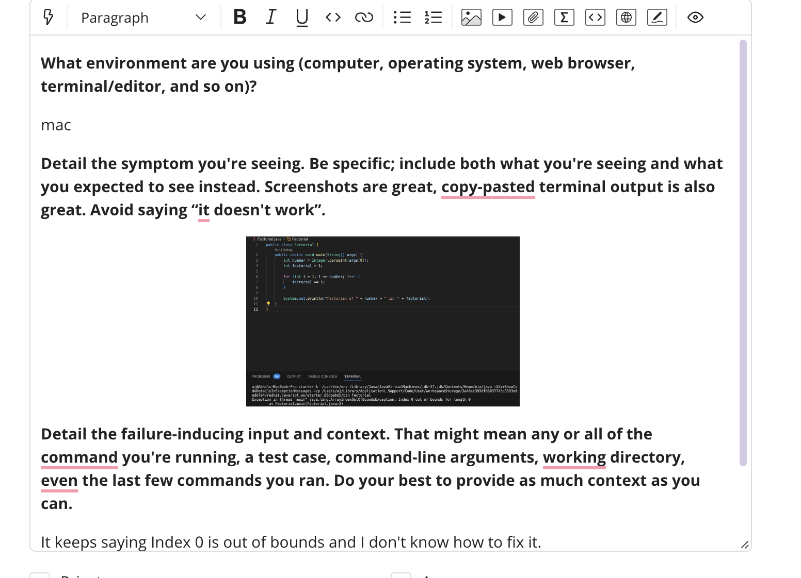
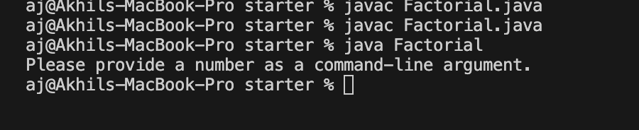

## Lab 5

### Part 1

1. 

##### Ta response:
The bug in this case happens when trying to access the command-line argument args[0] without checking if it exists. So try adding a line that 
checks to make sure that a command-line argument is provided before accessing args[0].
<br />
<br />

2. 
3. The file structure needed for this program was a java file and a bash script. The contents in the java file was:
```
public class Factorial {
    public static void main(String[] args) {
        int number = Integer.parseInt(args[0]);
        int factorial = 1;

        for (int i = 1; i <= number; i++) {
            factorial *= i;
        }

        System.out.println("Factorial of " + number + " is: " + factorial);
    }
}
```
and the bash script:
```
number=$1
factorial=$(java Factorial $number)

echo "Factorial of $number is: $factorial"
```
To fix the bug you had to change the java file for it to check that a command-line argument is provided before accessing args[0]. and for the bash script I added a conditional statement to check if the command-line argument is empty using ```[ -z "$1" ]```.

### Part 2
I learned about two very important text editors that allow for remote changes of text files. Vim was what we focused on more rather than Nano. I also learned a good bit of debugging. I havent really debugged before this class and going to lab and actually sitting down and debugging random files helped me as a coder.
